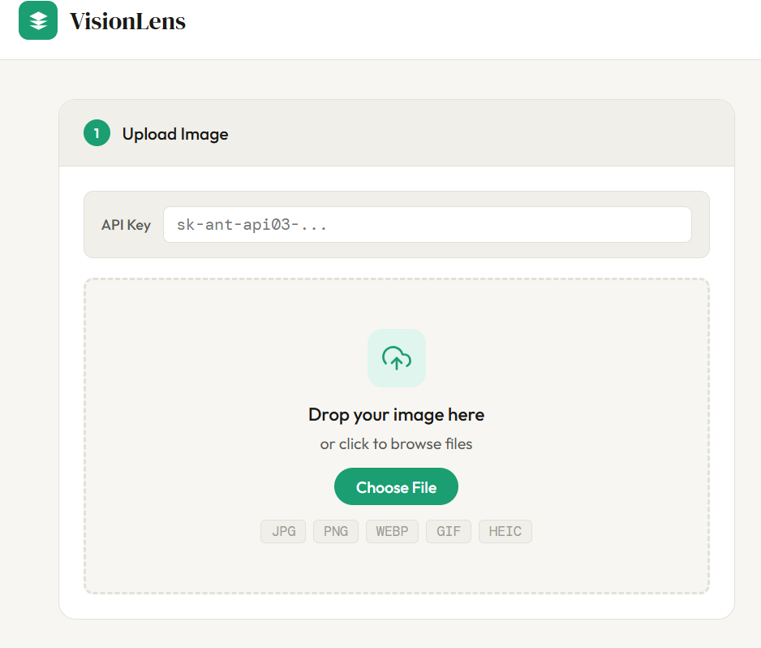
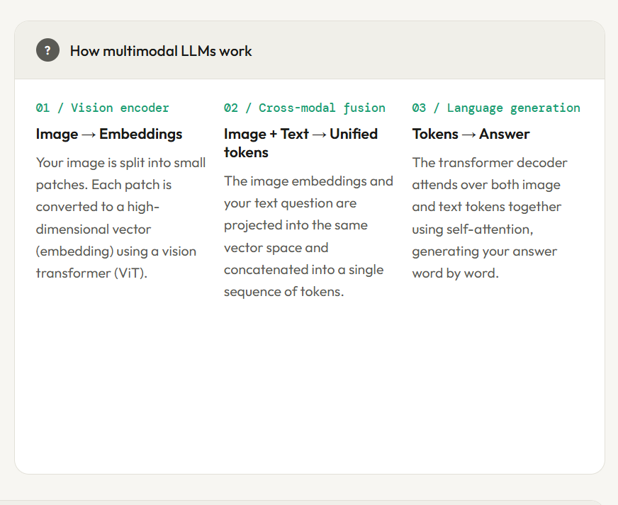
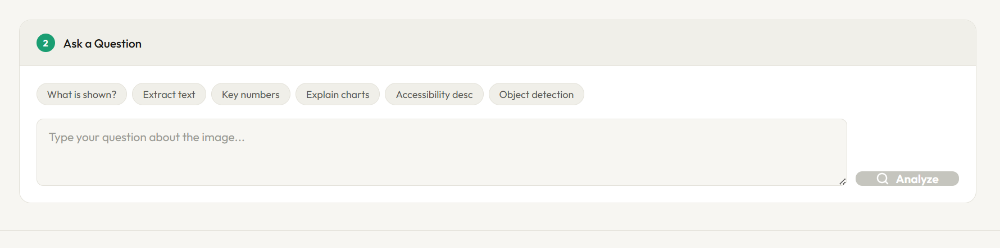

# VisionLens — Multimodal AI Image Analyzer

An interactive multimodal AI web application that allows users to upload images and ask natural language questions about visual content using advanced vision-language models.

VisionLens combines computer vision and large language models (LLMs) to perform image understanding, OCR, object detection, accessibility descriptions, chart interpretation, and contextual reasoning through a clean and responsive interface.

---

## Features

* Upload and analyze images using AI
* Supports JPG, PNG, WEBP, GIF, and HEIC formats
* Automatic HEIC to JPEG conversion for iPhone photos
* Ask natural language questions about uploaded images
* OCR and text extraction from images
* Chart and diagram interpretation
* Object identification and spatial understanding
* Accessibility-focused image descriptions
* Responsive modern UI
* Real-time AI analysis results

---

## Demo Preview

Add screenshots here after uploading them to your repository.







---

## Tech Stack

### Frontend

* HTML5
* CSS3
* Vanilla JavaScript

### Backend

* Python
* `http.server`

### AI & APIs

* Anthropic Claude API
* Multimodal Vision-Language Model

### Libraries

* heic2any

---

## Project Architecture

The application follows a lightweight client-server architecture:

1. Users upload an image through the frontend
2. Images are converted to Base64 format
3. The Python proxy server securely forwards requests
4. Claude Vision API processes image + text together
5. AI-generated responses are displayed in real time

---

## How Multimodal AI Works

### 1. Vision Encoding

Images are divided into patches and converted into embeddings using a Vision Transformer (ViT).

### 2. Cross-Modal Fusion

Visual embeddings and text embeddings are merged into a shared representation space.

### 3. Language Generation

The transformer attends to both image and text tokens to generate contextual responses.

---

## Installation & Setup

### Clone the repository

```bash
git clone https://github.com/your-username/IMAGE_LLM.git
cd IMAGE_LLM
```

---

### Run the application

```bash
python start.py
```

Then open:

```txt
http://localhost:8000
```

---

## Getting an API Key

1. Visit https://console.anthropic.com
2. Create an API key
3. Paste the key into the application interface

---

## Folder Structure

```txt
IMAGE_LLM/
│
├── index.html
├── start.py
├── README.md
└── screenshots/
```

---

## Future Improvements

* Multiple image uploads
* PDF and document analysis
* Streaming AI responses
* Voice-based interaction
* Model selection (Claude / GPT / Gemini)
* Cloud deployment support
* Authentication system

---

## Learning Outcomes

This project helped explore:

* Multimodal AI systems
* Vision-language model workflows
* API integration
* Frontend-backend communication
* Image preprocessing pipelines
* Responsive UI/UX design

---

## Author

Atul Kumar Meghwal

GitHub: https://github.com/AtulKumarMeghwal135

---

## License

This project is open-source and available under the MIT License.
